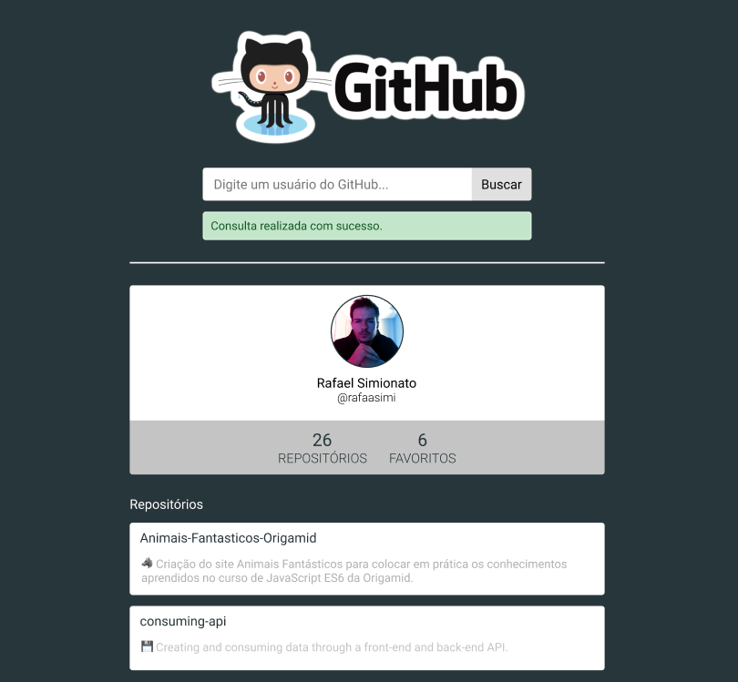

## 🔖 Descrição

🐙 Criação de uma aplicação para consumo da GitHub API.

---

## 🚀 Technologies
This project is using the following technologies:
- HTML
- CSS
- Javascript

---

## 🎲 How to use
	$ cd consuming-api
    Open index.html

---

## 🎨 Layout

---

## 📝 Licença

The project is under MIT license. For more details, visit <a href='LICENSE'>license<a>.

---

Create with 💙 by <a href='https://github.com/rafaasimi/' target='_blank'>Rafael Simionato</a>

